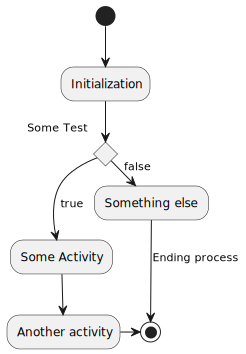

<!-- README.md is generated from README.Rmd. Please edit that file -->

```{r setup, echo = FALSE, include = FALSE}
devtools::load_all(here::here())
```
-----

[](https://doi.org/10.5281/zenodo.1922215)

[](https://github.com/rkrug/plantuml/actions)
[](https://codecov.io/github/rkrug/plantuml?branch=master)
[](https://www.tidyverse.org/lifecycle/#maturing)
 
 -----
 
 
# Overview
This package provides the functionality to create UML graphs using the [PlantUML](https://plantuml.com/) language.

# Installation

## Prerequisites
The actual work is done by the program [plantuml](https://plantuml.com/). Please see [the plantuml installation page](https://plantuml.com/faq-install) for prerequisites of running plantuml. 

## Installation of plantuml
The package is not on CRAN, but it is in the [R-Universe](https://rkrug.r-universe.dev/ui#package:plantuml). The original installation instructions can be found there, but are here reproduced fdor simplicity:

```{r installation_plantuml, eval = FALSE}
# Enable repository from rkrug
options(repos = c(
  rkrug = 'https://rkrug.r-universe.dev',
  CRAN = 'https://cloud.r-project.org'))
# Download and install plantuml in R
install.packages('plantuml')
# Browse the plantuml manual pages
help(package = 'plantuml')
```

# Plotting Plantuml graphics
## Define plantuml code
First, we define a plantuml object based on some plantuml code 
```{r definePlantuml}
library(plantuml)
x <- '
(*) --> "Initialization"

if "Some Test" then
  -->[true] "Some Activity"
  --> "Another activity"
  -right-> (*)
else
  ->[false] "Something else"
  -->[Ending process] (*)
endif
'
x <- plantuml( 
  x
)
```

## Plotting to a file
To save the graph in a file, we simply specify the `file` argument in the plot command:
```{r exampleFile, eval = FALSE}
plot( 
  x, 
  file = "./vignettes/test.svg" 
)
```

And here is the file



The type of the file is automatically determined based on the extension. Plantuml retturns an svg file, wi=hich is than converted using Suported extensions in plantuml are:

    - svg	  To generate images in SVG format
    - png	  To generate images in PNG format
    - pdf		To generate images in PDF format
    - ps		To generate images in PS format
    - txt		To generate images with ASCII art

# Plotting R objects

In addition to plotting based on plantuml code some basic functionality to document R objects has been included. 

This is not much more than a proof of concept but includes all standard R objects. 

**<span style="color:green">If you think this is usefull, pelase let me know and leave sugestions in the issue tracker.</span>**

One example is:

```{r exampleObject}
x <- list(
  a = 1:10,
  b = letters[1:4],
  c = data.frame(
    x = 1:10,
    y = c(TRUE, FALSE)
  )
)
plot(
  as.plantuml(x)
)

```

<!-- # **<span style="color:red">TODO</span>** -->
<!-- - make selection dependant on installed packages, as `vector = TRUE` requires postscript to be installed! -->
<!-- - update documentation and  -->
<!-- - add tests for `plot.plantuml()` -->
 
