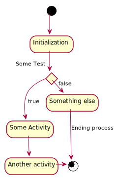

```{r setup, echo = FALSE, include = FALSE}
devtools::load_all(here::here())
```
# Overview
This package provides the functionality to create UML graphs using the [PlantUML](http://plantuml.com/) language.

# Installation

## **<span style="color:red">ATTENTION</span>**
This packege `plantuml` uses the package `grImport` for plotting to a graphics device. In the CRAN version (`0.9-0`)the function `PostScriptTrace()` does not clean up a temporary file which iscreated in theworking directory. This ahs been fixed in R-Forge. I recommend to install the package from the github mirror from R-Forge by using

```{r installation_ATTENTION, eval = FALSE}
devtools::install_github("rforge/grimport/pkg/grImport")
```

## Prerequisites
The actual work is done by the program [plantuml](http://plantuml.com/). Please see [the plantuml installation page](http://plantuml.com/faq-install) for prerequisites of running plantuml. You don't have tio install the plantuml.jar file, as the packagae maintains it's own version (see below).

As the package is only on github, you need `devtools` to install it easily as a prerequisite

```{r installation_prerequisites, eval = FALSE}
install.packages("devtools")
```

## Installation of plantuml
The package is not on CRAN, so you have to install it from github. Also, it doez not come with the plantuml binary, which needs to be installed as well:
```{r installation_plantuml, eval = FALSE}
# Install plantuml from github
devtools::install_github("rkrug/plantuml")

# download and install the PlantUML jar file from \link{http://plantuml.com/download}
# whenever you call this command again, the plantuml binary will be updated to the newest version
library(plantuml)
updatePlantumlJar()
```

# Plotting Plantuml graphics
## Define plantuml code
First, we define a plantuml object based on some plantuml code 
```{r definePlantuml}
library(plantuml)
x <- '
(*) --> "Initialization"

if "Some Test" then
  -->[true] "Some Activity"
  --> "Another activity"
  -right-> (*)
else
  ->[false] "Something else"
  -->[Ending process] (*)
endif
'
x <- plantuml( 
  x
)
```

## Plot via vector format
Now we plot in in a device using vector format (svg) as intermediate format, which is the default

```{r exampleDeviceVector}
plot( 
  x = x
# vector = TRUE
  )
```

## Plot via raster format
When using `vector = FALSE` uses a raster format (png) as intermediate format

```{r exampleDeviceRaster}
plot( 
  x = x,
  vector = FALSE
  )
```


## Plotting to a file
To save the graph in a file, we simply specify the `file` argument in the plot command:
```{r exampleFile}
plot( 
  x, 
  file = "./README_files/test.svg" 
)
```

And here is the file



The type of the file is automatically determined based on the extension. Suported extensions in plantuml are:

    - png		To generate images using PNG format (default)
    - svg		To generate images using SVG format
    - eps		To generate images using EPS format
    - pdf		To generate images using PDF format
    - vdx		To generate images using VDX format
    - xmi		To generate XMI file for class diagram
    - scxml		To generate SCXML file for state diagram
    - html		To generate HTML file for class diagram
    - txt		To generate images with ASCII art
    - utxt		To generate images with ASCII art using Unicode characters
    - latex		To generate images using LaTeX/Tikz format
    - latex:nopreamble	To generate images using LaTeX/Tikz format without preamble
   
# Plotting R objects


In addition to plotting based on plantuml code some basic functionality to document R objects has been included. 

an example is:

```{r exampleObject}
x <- list(
  a = 1:10,
  b = letters[1:4],
  c = data.frame(
    x = 1:10,
    y = c(TRUE, FALSE)
  )
)
plot(
  as.plantuml(x)
)

```

This is work in progress and the layoput is likely to change.

# **<span style="color:red">TODO</span>**
- make selection dependant on installed packages, as `vector = TRUE` requires postscript to be installed!
- update documentation and add tests
- complete travis tests 
