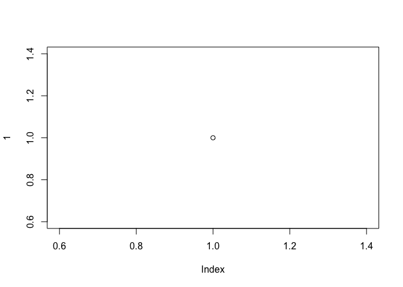

PlantUML in R
================

    ## Loading plantuml

# Overview

This package provides the functionality to create UML graphs using the
[PlantUML](http://plantuml.com/) language.

# Installation

The package is not on CRAN, so you have to install it from github:

``` r
# From github
# install.packages("devtools")
devtools::install_github("rkrug/plantuml")

# download and install the PlantUML jar file from \link{http://plantuml.com/download}
library(plantuml)
updatePlantumlJar()
```

# Usage

In a graphical device

``` r
library(plantuml)
x <- '
 @startuml
  --> "First Activity"
 -->[You can put also labels] "Second Activity"
 -->
 @enduml
'
x <- as.plantuml( x )
plot( x )
```

<!-- --><!-- -->

which uses a raster format (png) as intermediate format, while

``` r
plot( 
  x = x,
  vector = TRUE
  )
```

<!-- --><!-- -->

uses a vector format (eps) as intermediate format.

To save in a file

``` r
x <- '
 @startuml
  --> "First Activity"
 -->[You can put also labels] "Second Activity"
 -->
 @enduml
'
x <- as.plantuml( x )
plot( x, file = "./README_files/test.svg" )
```

And here is the file


# Additional info

# \* **<span style="color:red">TODO</span>**

  - **<span style="color:red">TODO</span>** make selection dependant on
    installed packages, as `vector = TRUE` requires postscript to be
    installed\!
  - **<span style="color:red">TODO</span>** update documentation and add
    tests
